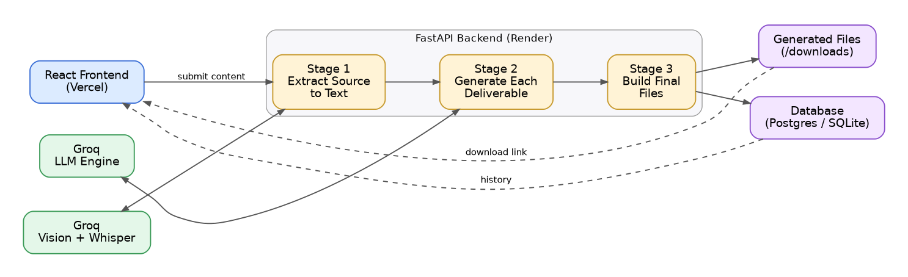

# GEN AI Platform for Automated Content Transformation

A single piece of source content in, every communication deliverable you need out — LinkedIn posts, advisories, executive briefings, presentations, infographics, tweet threads, and video packages, all generated from the same source in one pass.

Live demo: https://sih-project-ps-154.vercel.app/

## SIH Details

- Team Name: MINIMAX
- Team ID: 167397
- Problem Statement ID: SIH26154
- Problem Statement Title: GEN AI Platform for Automated Content Transformation

## Problem Statement

Organizations regularly need to turn source material — news articles, reports, advisories, threat intelligence, policy documents, research papers, incident reports, or informal notes — into specific communication formats for different audiences and purposes. Doing this by hand for every deliverable is slow, inconsistent across formats, and depends heavily on whoever is writing having both communication skills and domain knowledge. There was a clear need for a platform that could take one source and reliably produce whichever output format an operator asks for, without redoing the analysis from scratch each time.

## Solution

This platform accepts source content in whatever form it naturally exists — typed text, a PDF, a slide deck, an audio recording, a video, or an image — and lets the operator choose one or more output types from a dashboard. The system analyzes the source once, then generates every selected deliverable from that same understanding, so the outputs stay consistent with each other. Generation is steered through configurable parameters: target audience, tone, language, level of detail, communication objective, and an optional free-text focus directive for anything more specific.

## Key Features

- Accepts text, PDF, PPTX, audio, video, image etc.. inputs
- Generates multiple output formats from the same source in a single run
- Configurable audience, tone, language, detail level, and objective
- Multilingual output support: English, Tamil, Hindi, Malayalam, Telugu
- Produces real downloadable files, not just on-screen text
- Session persistence so form progress survives a page reload
- Searchable history of past generations with re-download support
- Fast inference throughout, powered by Groq Cloud

Supported output types: Plain Text Summary, LinkedIn Post, X/Twitter Thread, Advisory Document, Executive Summary, Infographic Brief, Slide Presentation, Audio Briefing, and a Video Production Package (script, storyboard, timed subtitles, and visual recommendations).

## System Architecture

The system is a decoupled full-stack application: a React frontend communicates with a FastAPI backend over a REST API, and the backend calls out to Groq for all AI inference.



The backend pipeline runs in three stages. First, whatever was submitted is converted into plain text — documents are parsed directly, audio and video are transcribed with Whisper, and images or video frames are described using a vision model. Second, the LLM generates each requested deliverable against a fixed content contract for that output type, with prompt rules that keep it grounded in what the source actually says rather than inventing facts. Third, each deliverable is rendered into its real file format — a styled PDF, a slide deck, a plain text file, or spoken audio.

## Tech Stack

Frontend: React with Vite, deployed on Vercel.

Backend: FastAPI running on Uvicorn, deployed on Render.

AI and inference: Groq Cloud for LLM generation, vision analysis, and Whisper speech-to-text.

Document and media generation: reportlab for PDFs, python-pptx for slide decks, pypdf for PDF parsing, gTTS for audio narration, and OpenCV/ffmpeg for video processing.

Database: Supabase Postgres in production, with automatic fallback to local SQLite when no database URL is configured.

## Project Structure

├── backend/
│   ├── file_handler.py     # Ingestion, generation, and file-building pipeline
│   ├── server.py           # FastAPI routes, CORS, static file serving
│   ├── init_db.py          # Database connection and schema setup
│   └── output_files/       # Generated deliverables, served at /downloads
│
├── diagrams/
│   └── architecture.png    # System architecture workflow diagram
│
├── frontend/
│   └── transform_AI/
│       └── src/
│           └── App.jsx      # Dashboard, output selection, and history view
│
└── screenshots/
    ├── dashboard.png       # Live UI dashboard screenshot
    └── history.png         # Historical transaction ledger screenshot


## Installation & Setup

You'll need Python 3.11 or later, Node.js 18 or later, and a Groq API key from console.groq.com. A Supabase connection string is optional — without one, the backend falls back to local SQLite automatically.

Backend, from the project root:

```
cd backend
python -m venv venv
source venv/bin/activate        # Windows: venv\Scripts\activate

pip install fastapi uvicorn pydantic python-multipart groq pypdf python-pptx reportlab gtts opencv-python imageio-ffmpeg psycopg2-binary

export GROQ_API_KEY=your_key_here
# optional — omit to use local SQLite instead
export DATABASE_URL=your_supabase_connection_string

python init_db.py
```

Frontend:

```
cd frontend/transform_AI
npm install
npm run dev
```

## Environment Variables

- `GROQ_API_KEY`, required: read in `backend/file_handler.py`, used for LLM generation, vision analysis, and speech-to-text via Groq Cloud
- `DATABASE_URL`, optional: read in `backend/server.py` and `backend/init_db.py`; connects to Supabase Postgres when set, falls back to local SQLite automatically when unset

The frontend's backend URL is not read from an environment variable — it's set directly in `frontend/transform_AI/src/App.jsx`:

```
const API_BASE_URL = "https://sih-project-ps-154.onrender.com";
```

This already points at the deployed backend, so the frontend works out of the box against production. To run the frontend against a local backend instead, change this line to `http://localhost:8000` before running `npm run dev`.

## How to Run

Start the backend first, from inside the `backend/` folder:

```
uvicorn server:app --reload --port 8000
```

Or from the project root instead:

```
uvicorn backend.server:app --reload --port 8000
```

Then start the frontend from `frontend/transform_AI/`:

```
npm run dev
```

By default the frontend points at the live Render deployment regardless of whether a local backend is running, since `API_BASE_URL` is hardcoded in `App.jsx` rather than read from an environment file — see the note above if you want it talking to your local backend instead.

## Screenshots / Demo

Live deployment: https://sih-project-ps-154.vercel.app/

[Dashboard - Input Formats and Output Deliverables](./screenshots/dashboard.png)

The dashboard where an operator submits source content, picks one or more output deliverable types, and sets generation parameters.

[History View](./screenshots/history.png)

The history view, showing past generation runs with search and re-download support.

Add these two image files to a `/screenshots` folder in the repository root for them to render.


## Deployment

The frontend is deployed on Vercel and the backend on Render, connected over a REST API with CORS enabled for cross-origin requests. The database runs on Supabase Postgres in production, with local SQLite as the development fallback.

## Future Improvements

- Full video rendering, beyond the current script and storyboard package
- A shared analysis step feeding all selected deliverables, for tighter consistency across formats generated in the same run
- User authentication and per-user history
- Additional output types such as press releases, incident timelines, and FAQ generation
